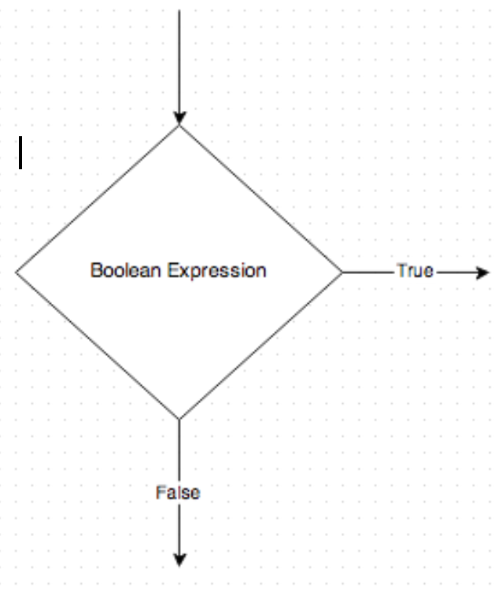
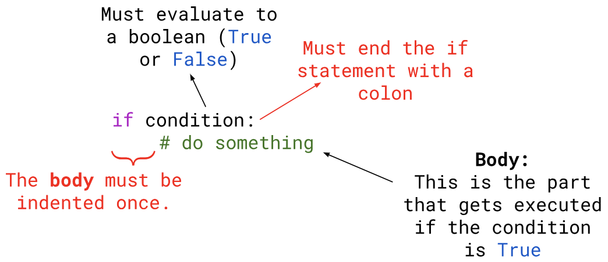
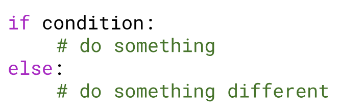
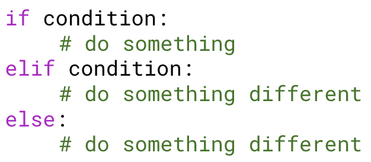
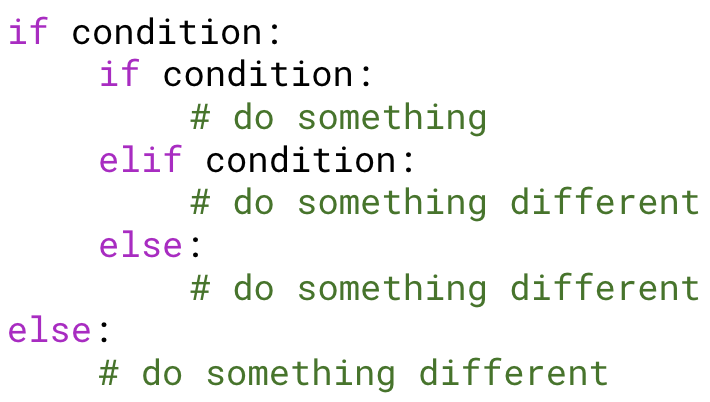
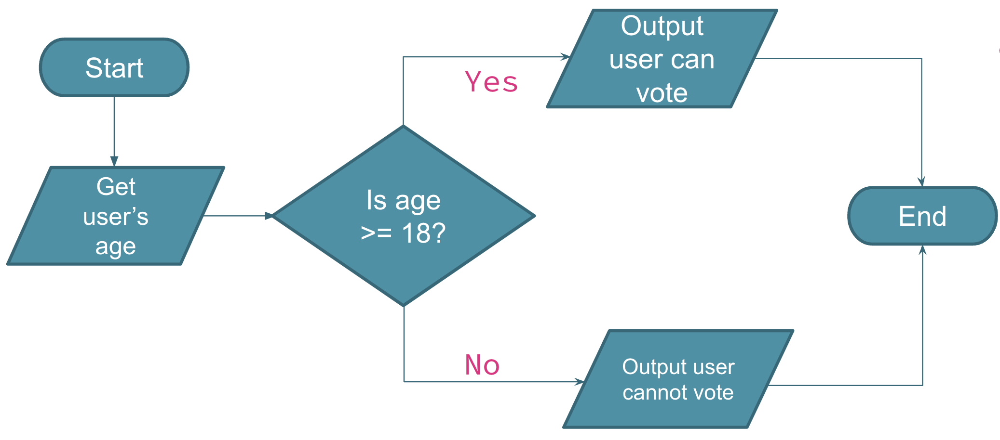

# 4.5 If Statments

## Decisions
Before we start, let's think about decisions we have made. What decisions have you made today since waking up this morning?

So far, all the programs we have written goes in a linear direction. Python reads each line, one at a time, from top to bottom. How do we incorporate **decisions** into our programs? We add decisions by using something called: **`if` statements**

## Flow Charts
We've seen how to make decisions in a program before when we created flowcharts. Here is a reminder:

- Inside the diamond is the decisions we need to make.
- The decision must be a **boolean expression** that evaluates to either `True` or `False`
- There can only be **TWO arrows** that come out of the decision

## General Form

There are 3 main parts to an `if` statement:
1. **The header** - the part with the `if` and the condition
2. **The condition** - a boolean expression that evaluates to `True` or `False`
3. **The body** - the indented part that runs when the condition is `True`

### The condition
* The condition **MUST** evaluate to `True` or `False`
* It can be any of the following:
  * `True`
  * `False`
  * A variable
  * A boolean expression using comparison and/or logical operators

>When the condition is `True`, the body of the `if` statement will **run** 
>When the condition is `False`, the body of the `if` statement will **NOT run**

As of right now, we can only execute something for one condition. What if we have 2 or 3 or even more decisions to make?

## Alternative Execution
A second form of the `if` statement is **alternative execution**, in which there are *two* possibilities and the condition determines which one gets executed. The general form is:

#### Things to keep in mind about structure:
* `else` is followed by a colon
* `else` is in line with the `if` statement before it
* The body is again indented once

#### Terminology
Since both the `if` statement and the `else` statement have a body, we can easily refer to them by using the word **branch**. So we can say **if branch** and **else branch**.

## Chained Conditionals
Sometimes there are more than two possibilities and we need more than two branches.
One way to express a computation like that is a **chained conditional**.

* `elif` is an abbreviation of “else if.”
* Exactly one branch will be executed. 
* There is no limit on the number of `elif` statements.
* If there is an `else` clause, it has to be at the end, but there doesn’t have to be one.

## Nested Conditionals
One conditional can also be nested within another. This means you can put another set of if/elif/else statements INSIDE an if/elif/else statment. It might look something like this:

Although the indentation of the statements makes the structure apparent, nested conditionals become difficult to read very quickly. In general, it is a good idea to avoid them when you can.

## Example
>Write a program that determines if a user can vote or not.

We created a flow for this program back in Unit 2. Here is a reminder of what that looks like:

Now that we know some basics of programming and `if` statements, let's try to write a program for this. Follow along in CanYouVote.py